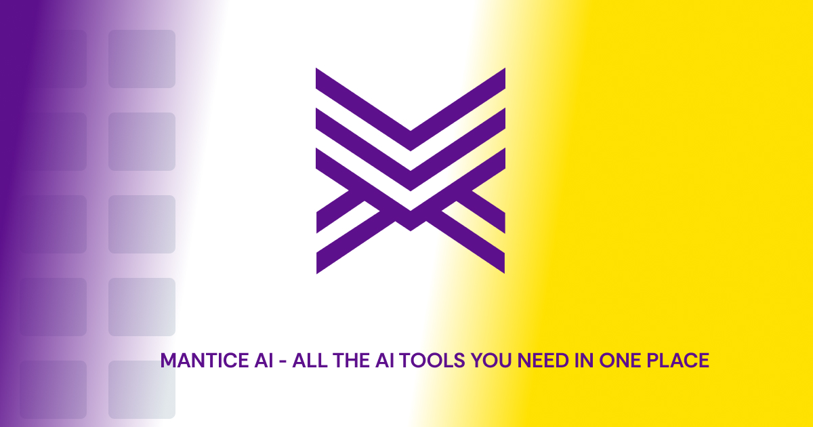

# Mantice AI Landing Page

[](https://opensource.org/licenses/MIT)
[](https://nextjs.org/)
[](https://tailwindcss.com/)
[](https://www.typescriptlang.org/)

A modern, responsive landing page built with Next.js, Tailwind CSS, and TypeScript. Features a clean design with dark mode support, animations, and comprehensive sections for showcasing AI products and services.



## 🌟 Features

- 🎨 Modern, clean UI design
- 🌙 Dark mode support
- 📱 Fully responsive
- ⚡ Performance optimized
- 🔒 Security-focused architecture
- 🎯 SEO optimized
- 🎭 Customizable components
- 📊 Status page
- 📝 Blog integration ready
- 💳 Pricing page

## 🚀 Tech Stack

- [Next.js 13](https://nextjs.org/) - React framework
- [Tailwind CSS](https://tailwindcss.com/) - Utility-first CSS framework
- [TypeScript](https://www.typescriptlang.org/) - Type safety
- [Lucide Icons](https://lucide.dev/) - Beautiful icons
- [next-themes](https://github.com/pacocoursey/next-themes) - Dark mode support
- [Framer Motion](https://www.framer.com/motion/) - Animations
- [shadcn/ui](https://ui.shadcn.com/) - UI components

## 📦 Installation

1. Clone the repository:

```bash
git clone https://github.com/yourusername/mantice-landing-page.git
```

2. Install dependencies:

```bash
cd mantice-landing-page
npm install
```

3. Create a `.env.local` file in the root directory:

```env
NEXT_PUBLIC_APP_URL=http://localhost:3000
NEXT_PUBLIC_BACKEND_URL=http://localhost:8000
```

4. Run the development server:

```bash
npm run dev
```

Visit `http://localhost:3000` to see your application.

## 🏗️ Project Structure

```
mantice-landing-page/
├── app/                    # Next.js app directory
│   ├── about/             # About page
│   ├── blog/              # Blog page
│   ├── contact/           # Contact page
│   ├── pricing/           # Pricing page
│   ├── security/          # Security page
│   ├── status/            # Status page
│   └── page.tsx           # Home page
├── components/            # Reusable components
├── constants/             # Constants and configuration
├── lib/                   # Utility functions
├── public/               # Static assets
└── types/                # TypeScript types
```

## 🎨 Customization

### Themes

The project uses CSS variables for theming. Modify the colors in `globals.css`:

```css
:root {
  --primary: 220 14% 96%;
  --secondary: 220 14% 90%;
  ...;
}

.dark {
  --primary: 220 14% 4%;
  --secondary: 220 14% 10%;
  ...;
}
```

### Components

Components are built using [shadcn/ui](https://ui.shadcn.com/). You can customize them in the `components/ui` directory.

## 🔧 Available Scripts

- `npm run dev` - Start development server
- `npm run build` - Build production version
- `npm run start` - Start production server
- `npm run lint` - Run ESLint
- `npm run type-check` - Run TypeScript compiler check

## 📄 License

This project is open source and available under the [MIT License](LICENSE.md).

## 🤝 Contributing

Contributions are welcome! Please feel free to submit a Pull Request.

## 📝 Usage & Modification

Feel free to use this code as a template for your own projects. You can modify and adapt it to your needs. Please remember to:

1. Replace all instances of "Mantice AI" with your own brand
2. Update the content to match your services
3. Replace images with your own assets
4. Customize the color scheme and design elements
5. Update the meta information in `app/layout.tsx`

## 🚨 Support

For support, please open an issue in the GitHub repository.

## 🌟 Credits

- Design inspired by modern SaaS landing pages
- Icons by [Lucide](https://lucide.dev/)
- UI components by [shadcn/ui](https://ui.shadcn.com/)

---

Made with ❤️ using Next.js and Tailwind CSS
